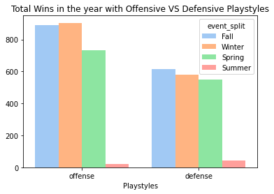

# Winning Strategies in the Rocket League Championship Series 2021-22

Simply described as soccer but with rocket-powered cars, Rocket League is one of the most competitive video games in the industry with thriving e-sports tournaments. Most notable and prestigious among them is the Rocket League Championship Series (RLCS) whose participants include  professional e-sports teams from all over the world competing for millions of dollars in prize earnings.

The championship season is divided into 4 splits:
- Fall major
- Winter major
- Spring major
- Worlds.

Teams accumulate points based on their rankings in these events, which allow them to qualify for the world championship.

Teams come from the following regions:
- [NA] North America
- [EU] Europe
- [SAM] South America
- [OCE] Oceania
- [MENA] Middle East & North Africa
- [APAC] Asia Pacific North/South
- [SSA] Sub-Saharan Africa

NA and EU have traditionally had the best performing teams but promising teams have begun to emerge from MENA and SAM.

Some questions we have about this topic include:

- What play styles (ground, aerial) have higher chances to win a game?
- Do players from specific regions play more aggressively or passively than those from other regions?
- Does playing faster than the opposing team prove to be a more successful strategy?

## About the dataset

This dataset focuses on the most recent iteration of RLCS, the 2021-2022 season. It includes statistics such as the number of goals per team in a match, the number of saves, amount of boost used, assists made, total number of shots, total distance traveled and much more. It includes the data from every match, from every team and from every split.

This dataset has been constructed by saving the games from every match during the tournament, extracting the data from the save files and organizing it into a presentable format. The corporations and groups included in this procedure include Psyonix (the game studio behind Rocket League and organizer of RLCS) and octane.gg, the website hosting all of this data.

Our purpose for working behind this is educational and out of personal curiosity but we hope to gain insight into what strategies the winning teams employ, and then extrapolate our findings to predict which teams will win in future tournaments.

## Team Members

**Please remember to update this section**

- Ahmad Saleem Mirza: CS Major and avid Rocket League fan
- Jared Waldroff: CS Major and EDM producer
- Gurkirat Toor: CS Major and enjoy spending my time playing basketball and fifa.

## **Exploratory Data Analysis**

Upon looking through the data we had many questions about what certain play styles would result in more games won. From things like demolitions committed on the opposing team, where you were located in terms of the field, wether you were in the air or on the ground. We looked through all the data provided and started asking questions. Would taking more shots on the opposing team's net result in more wins?

This shows that teams who win take on average 9 more shots on net than teams that lose.

Other major indicators included our defense and total distance moved. We noticed most teams playing offensively and imagined how a defensive playstyle would hypothetically pan out in a game. Speed is yet another crucial in-game statistic: faster movement around the field looks harder to execute and more skillful, but does the data back this up? Would merely playing faster allow a team to secure a victory?

Exploring the data in this way gave us a little more insight into how we should proceed, the questions we want to ask and how we were going to go about answering those questions with the data provided.

## Notebook 1: Ahmad Saleem Mirza

I focused on 3 different aspects of the data in my notebook:
- **ground and aerial** playstyle success rates
- **aggressive and passive** playstyles across regions
- improving **goal keeping**

Since in Rocket League the player controls a rocket-powered car, you have the ability to jump, title the nose of your car upward and fire the rocket, allowing you to fly in the air to reach the ball while it's in the air.

A ground playstyle is where a team stays on a ground for most of the match, whereas an aerial playstyle is where a team spends more time flying in the air.

To compare which is more successsful, I compared game wins with both playstyles.

In the first plot, we see that in total, ground playstyles have had more wins than aerial playstyles.

This was puzzling to me, as I had always thought aerial playstyles look flashier and required more skill, so they had to have been better!

So I plotted a visualization (right) of wins at the *majors* that took place throughout the season. A major is an international event where teams from all around the world compete, thus representing a high level of competition. We see that at this stage, there are more aerial wins across the board, with the Summer major (the World Championship) having nearly all of its wins from aerial playstyles.

I concluded from this, that though it is possible to win with a ground playstyle at lower levels of play, for higher, more prestigious events players MUST be more aerial to create opportunities to score goals.
___
Rocket League has become an increasingly international game: where once the best teams were unquestionably either from America or Europe, in this season teams from the Kingdom of Saudia Arabia and Brazil proved themselve to be formidable foes. Players from these countries are perceived to have aggressive playstyles, which means they played faster, used more boost and bumped into their opponents to disrupt their plays more often. I wanted to see how playstyles shifted across participating regions.

To that end, I viewed the distribution of aggressive and passive games of different regions. A few plots that stood out are:

*Note: these are not all of the regions that participated. See Notebook 1 for full list*

A common trend among all of these plots is that aggressive curves are further along the x-axis than the passive curves. The aggressive curve for *Asia-Pacific South* has the most area that is skewed toward the right, with a flatter top compared to the *Middle East*, showing there is less variation in the types of goals South Asians score: the score a consistently high number of goals whilst playing aggressively. 

In *Europe* the aggressive graph is much more uneven and is unique in that its shape is nearly identical to it's passive counterpart, showing that the European teams usually opt for a more balanced playstyle.

Another point of note:  *Sub-Saharan Africa* has the highest number of goals scored, indicating a select few South African teams are more successful with their aggressive game style than others. However, that does not make *Sub-Saharan Africa* the most aggressive region overall, as it only has a few teams that are good. The region lacks a depth of competition.
___
Lastly, I wanted to take a look at a critical aspect of the game, second only to actually make goals: making saves.

Not knowing how could measure good goal keeping ability, I began by comparing the correlation strength between 'core_saves' and various other columns in the dataset.

I was eventually able to narrow it down to goal-keeping ability and the positioning of the car on the field.

My findings revealed a strong link between the number of saves a team made and the time they spent in their *defensive third*.

But simply staying on your side of the court is not going to help with saving, especially if you are bumped by one of the opponents. The solution then is to simply move around more! This in-game mechanic is called **rotation**.

There is a strong positive relationship between the total distance a team moved around the field and the time they spent in the defensive third.

Additionally, players must be careful not to blindly chase after the ball but instead keep a distance from it and observe the play that is being made by the opponent, to try and predict where the ball is going next and reach it first. This is shown by an equal time spent behind the ball and time spent in front of the ball (see Notebook 1 for more details).

So to answer our question about how players can improve their goalkeeping, they should focus on rotating **around the field as much as possible to be both on the offense and defense as necessary. They have to avoid chasing after the ball but rather observe where it is about to go next and cover that position.**
___
## Notebook 2: Jared Waldroff

I had the question: Does a more aggressive play style win you more games in Rocket League?"

In rocket league an aggressive playlist involves inflicting demolitions on the opposing team, moving around the map a lot, taking more shots & using a lot of boost to increase speed and launch into the air. For the sake of this question I focused heavily on demolitions inflicted and shots taken. Demolitions caused on the opposing team makes takes their car out of play for 3 seconds.

Shown below is a plot of demolitions inflicted and goals scored. The number of shots was also used as the size of the point of the table.

As the number of demolitions inflicted increases up the Y axis the number of goals that are scored increase up the X axis. You can immediately notice a trend up and to the right which indicates a correlation. The shots taken can also be taken into factor here. We can see that as the number of shots taken from a team gradually increases as they score more goals from the size of the bubbles on the graph. These three factors all point towards the answer that yes, a more aggressive play style will win you get more goals to win your games.

Next I wanted to look directly at wins a team has compared to demolitions. Yes, we learned previously that demolitions get us more goals which get us more wins but what is the relationship between the two? 

Here we see how many demolitions a team will get on average when they lose and win.

You can see here that when a team loses they get on average 12 demolitions and when they win they get on average 13 demolitions. I honestly expected more of a difference when it came to demolitions and games won. We can still see though that the evidence is here for having a more aggressive play style.

We focused on demolitions, now let's look at shots taken and goals scored to give us a better idea exactly how they impact each other.

You can see here that trend going upwards of goals scored when the number of shots goes up. You can also see that on average a team takes 19 shots to score 1 goal. You can see this from the line going through the data. This line continues to go up and once teams are getting 20 goals they are taking around 50 shots. This again correlates with the idea of having a more aggressive play style will in fact score you more goals which will win you more games of rocket league.

## Noteook 3: Gurkirat Toor

We focussed on two major aspects of the game. The first being defense and the second being speed. 

In most video games an offensive playstyle is usually the most effective and popular playstyle. We wanted to see if playing defensively would be an effective way to play. With a game so dependent on speed and pushing the ball up the field would it be effective to play defensively and stay back in order to prevent goals. I wanted to see if speed and defensive could work together to create more wins So with my research we first tried to answer the question:

# Does more time spent on the defensive half correlate with more wins?

In graph below we looked at the total wins based on offensive vs defensive playstyles. To visualize this better we split the data among the seasons. 

From our data we can see that playing offensively will lead to more wins. We can see that at the peak the offensive playstyle in the winter lead to almost 900 wins compared to the 600 defensive wins. We can see that from our data my question was proven false and that it is better to play offensively. Of course, this was not an accurate depiction of the best teams in the league so we went to more into depth and looked at the teams that played in Majors.

After filtering our data further we are able to see how more successful teams play. The information we have in front of us dictated that playing a defense oriented game will lead to more wins in majors. For all seasons except for spring we can see a significant difference in wins between the 2 playstyles. We see a huge difference in the summer season we can see that the defensive teams had more than 40 wins compared the offensive teams 20. From our data, we can see that when looking at all teams a defensive playstyle may not be the best for them, but for a more experienced and skillful team playing defensively will lead to more wins and better success. 

My second focus for this project was about the speed of the team. Speed can play a vital role for a team it can be the difference between who get the first touch on the ball and how much easier of a shot you can get. More speed can lead to better movement. With speed playing such a vital role in the overall game we wanted to answer the following question:

# Does playing faster than the opposing team prove to be a more successful strategy?

Since Rocket League games are a set length of time an easy to measure speed is with the total distance traveled. So to answer our question i wanted to look at the amount of goals vs distance traveled. 

# Total Distance Vs Goals

From our chart we can see that from the line that more speed carried throughout the game resulted in more goals. Although this is an accurate baseline measurement there are many factors in Rocket League such as boost boost plays a huge factor. Boost can push you from out of play back into play in a matter of seconds. When pushing to the ball it leaves your window to hit the ball feel longer when you move faster, it increases your reach area.  So to see if boost was equal to wins we visualized a graph that compares score against boost amount.

# Goals Vs Boost Consumption

From the plot we can see that the score is higher when boost is used more. When a team uses more boost the score is higher which will lead to more team success. Anytime that a team scored 4 goals they would win and they used a lot of boost, while teams that tend to use less boost lost.

With more movement ypu are able to play defensively will also being a offensive threat. The most important factor when trying to score goals would be shots created, to get more shots in theory you will need lots of speed and movement throughout the game. 

# Total Distance Traveled Vs Shots

# Goals Vs Shots 

From the graphs above you can see that the claims we made are accurate and that one of the important factor when trying to score goals is shots created and overall velocity is important to get shots. You can see that when we travel more total distance within a game we tend to create more opportunities which will lead to more success. A team that can create opportunities to score will have more goals. We can back up this claim from the graph above.  From the information we gathered in this notebook we can conclude that a defensive team that has more speed can and will be more successful in the World ChampionShip tournament and when they have more speed we are better equipped to win.

## **Conclusion**
After collectively reviewing of all our notebooks, there were certain trends we saw across each of our questions that had overlapping areas of interest. 

Starting with our comparison of aggressive and passive playstyles, we found the former to be a more effective strategy at winning games: teams with greater movement around the field, more shots on net and demolitions of the enemy team all contribute to a team’s ‘aggression’. This increased aggression improves a team’s chance of outplaying their opponent and securing a victory. However, an aggressive playstyle should not have precedence over the primary goal of the game: to outscore the opponent. As we saw, Asia-Pacific South was the most aggressive region among all the others, but they came in near last at the World Championships. Sporadically moving around the field and taking weak shots towards the net may contribute to greater aggression, but they don’t win matches. An aggressive playstyle should seek to complement the team’s goals.

Moving onto an aerial or ground playstyle, we saw that ground playstyles are much more popular at the lower level since they are easier to execute, thereby resulting in more wins in local tournaments. However, at higher levels of competition, such as Major or the World Championship, teams have to stick to an aerial based playstyle, as in these scenarios an overwhelming majority of the wins were aerial. This playstyle may also be called aggressive in some regard, as it involves moving around the field significantly more than a ground playstyle.

Lastly, we focused on the defensive strategies in the game. Our data signified the importance of the in-game mechanic called ‘rotation’: to not sitting idle in the goal and try to block incoming shots but rather move around the field predicting where the ball will go next and confusing the enemy about your next move. Whilst managing that they must also dedicate enough time to being on the offensive end and create goal scoring plays. It may sound impossible to manage being so dedicated to opposite ends of the field, but the top teams have shown it to be true.

In conclusion, our analysis both reinforced some pre-existing notions such as field rotation and challenged others, such as the success of ground playstyles in regionals. We as a group have learned to be more open minded to having our ideas challenged and conduct our research and present our findings in as much of an unbiased way as possible.

## References

Link to the original data source: https://www.kaggle.com/datasets/dylanmonfret/rlcs-202122  
