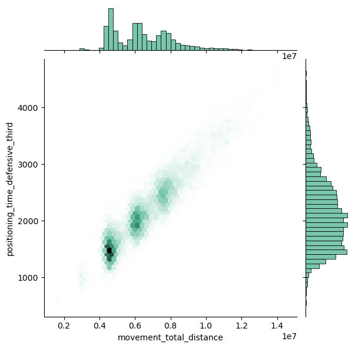

# Rocket League Championship Series 2021-2022: An analysis of game winning strategies and various other data

### *Group members:*

- Ahmad Saleem Mirza
- Jared Waldroff
- Gurkirat Toor

## **Introduction**

Described simply as "soccer but with rocket-powered cars", Rocket League has quickly risen to become one of the most popular competitive videogames in the entire e-sports industry. After 2 years of suspended play due to COVID-19, players and fans alike were excited for what the new season would bring with new players, new teams and new countries participating in the highest level of play ever seen. Having a shared interest in this game and an appreciation for the skill it takes to master it, we decided to examine the latest season's dataset and see what makes teams the best of the best.

## **Exploratory Data Analysis**

EDA here

## Notebook 1: Ahmad Saleem Mirza

I focused on 3 different aspects of the data in my notebook:
- **ground and aerial** playstyle success rates
- **aggressive and passive** playstyles across regions
- improving **goal keeping**

Since in Rocket League the player controls a rocket-powered car, you have the ability to jump, title the nose of your car upward and fire the rocket, allowing you to fly in the air to reach the ball while it's in the air.

A ground playstyle is where a team stays on a ground for most of the match, whereas an aerial playstyle is where a team spends more time flying in the air.

To compare which is more successsful, I compared game wins with both playstyles.

In the first plot, we see that in total, ground playstyles have had more wins than aerial playstyles.

This was puzzling to me, as I had always thought aerial playstyles look flashier and required more skill, so they had to have been better!

So I plotted a visualization (right) of wins at the *majors* that took place throughout the season. A major is an international event where teams from all around the world compete, thus representing a high level of competition. We see that at this stage, there are more aerial wins across the board, with the Summer major (the World Championship) having nearly all of its wins from aerial playstyles.

I concluded from this, that though it is possible to win with a ground playstyle at lower levels of play, for higher, more prestigious events players MUST be more aerial to create opportunities to score goals.
___
Rocket League has become an increasingly international game: where once the best teams were unquestionably either from America or Europe, in this season teams from the Kingdom of Saudia Arabia and Brazil proved themselve to be formidable foes. Players from these countries are perceived to have aggressive playstyles, which means they played faster, used more boost and bumped into their opponents to disrupt their plays more often. I wanted to see how playstyles shifted across participating regions.

To that end, I viewed the distribution of aggressive and passive games of different regions. A few plots that stood out are:

*Note: these are not all of the regions that participated. See Notebook 1 for full list*

A common trend among all of these plots is that aggressive curves are further along the x-axis than the passive curves. The aggressive curve for *Asia-Pacific South* has the most area that is skewed toward the right, with a flatter top compared to the *Middle East*, showing there is less variation in the types of goals South Asians score: the score a consistently high number of goals whilst playing aggressively. 

In *Europe* the aggressive graph is much more uneven and is unique in that its shape is nearly identical to it's passive counterpart, showing that the European teams usually opt for a more balanced playstyle.

Another point of note:  *Sub-Saharan Africa* has the highest number of goals scored, indicating a select few South African teams are more successful with their aggressive game style than others. However, that does not make *Sub-Saharan Africa* the most aggressive region overall, as it only has a few teams that are good. The region lacks a depth of competition.
___
Lastly, I wanted to take a look at a critical aspect of the game, second only to actually make goals: making saves.

Not knowing how could measure good goal keeping ability, I began by comparing the correlation strength between 'core_saves' and various other columns in the dataset.

I was eventually able to narrow it down to goal-keeping ability and the positioning of the car on the field.

My findings revealed a strong link between the number of saves a team made and the time they spent in their *defensive third*.

But simply staying on your side of the court is not going to help with saving, especially if you are bumped by one of the opponents. The solution then is to simply move around more! This in-game mechanic is called **rotation**.

There is a strong positive relationship between the total distance a team moved around the field and the time they spent in the defensive third.

Additionally, players must be careful not to blindly chase after the ball but instead keep a distance from it and observe the play that is being made by the opponent, to try and predict where the ball is going next and reach it first. This is shown by an equal time spent behind the ball and time spent in front of the ball (see Notebook 1 for more details).

So to answer our question about how players can improve their goalkeeping, they should focus on rotating **around the field as much as possible to be both on the offense and defense as necessary. They have to avoid chasing after the ball but rather observe where it is about to go next and cover that position.**
___
## Notebook 2: Jared Waldroff

## Noteook 3: Gurkirat Toor

## **Conclusion**
